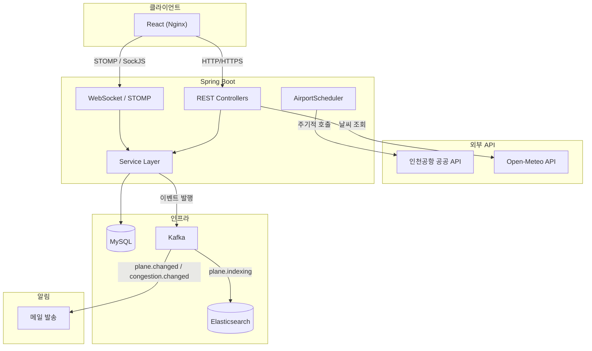
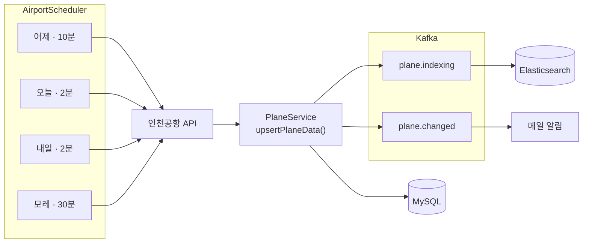

# Integrated Queueing System

인천공항 출국에 필요한 항공편·출국장·주차장·날씨 정보를 실시간으로 제공하고, 채팅을 통해 사용자 간 정보 교환을 지원하는 풀스택 프로젝트입니다.

> 개발 과정 블로그: [Velog 시리즈](https://velog.io/@ayeah77/series/%EA%B3%B5%ED%95%AD%EC%A0%95%EB%B3%B4-%EC%B1%84%ED%8C%85-%ED%94%84%EB%A1%9C%EC%A0%9D%ED%8A%B8)


## 기술 스택

| 분류 | 기술 |
|------|------|
| Framework | Spring Boot 3.4, Spring Security, Spring WebSocket (STOMP) |
| ORM / 쿼리 | JPA, QueryDSL 5.0 |
| Database | MySQL 8.0 |
| 메시징 | Apache Kafka 3.7 |
| 검색엔진 | Elasticsearch (Nori 한글 형태소 분석기) |
| 인증 | OAuth2 (Google, Kakao) + JWT |
| 메일 | Spring Mail + Thymeleaf 템플릿 |
| 인프라 | Docker Compose, AWS EC2, Nginx |
| Frontend | React.js, JavaScript |


## 아키텍처



### 항공편 데이터 동기화 파이프라인




## 주요 기능

### 항공편 정보
- 인천공항 공공 API를 통해 **어제 ~ 모레**까지 출발 항공편을 자동 동기화
- 날짜별 차등 주기: 오늘·내일(2분) / 어제(10분) / 모레(30분)
- Elasticsearch **Fuzzy 검색 + 한글 자동완성** 지원 (Nori 분석기)
- 매 자정 이틀 전 완료 항공편 자동 정리

### 항공편 구독 & 알림
- 관심 항공편 구독 시, **상태 변경(지연·결항·게이트 변경 등)을 메일로 알림**
- Kafka 이벤트 기반 비동기 처리 (`airport.plane.changed`)

### 출국장 혼잡도
- 터미널별 출국장 혼잡도 실시간 조회
- 혼잡도 변화 시 **출발 임박(6시간 이내) 구독 회원에게 메일 알림**
- 매 자정 전일 데이터 자동 정리

### 실시간 채팅
- WebSocket + STOMP 프로토콜 기반 채팅방 생성/참여
- 접속자 수 실시간 추적 및 브로드캐스트
- QueryDSL 기반 메시지 조회

### 부가 기능
- **주차장 현황**: 층별 주차 가능 대수 실시간 조회
- **날씨 정보**: 도착 공항(20개 주요 공항) 날씨 조회 (Open-Meteo, 10분 캐싱)
- **이동시간**: 공항철도(AREX) · 주차장별 소요시간 안내

### 인증
- OAuth2 소셜 로그인 (Google, Kakao)
- JWT Access Token + Refresh Token 기반 인증
- 자동 토큰 재발급


## API 엔드포인트

### 항공편

| Method | URL | 설명 |
|--------|-----|------|
| GET | `/airport/slice/planes?date={yyyyMMdd}` | 날짜별 항공편 페이징 조회 |
| GET | `/api/flights/search?q=&terminal=&date=&airline=` | 항공편 복합 검색 (Fuzzy) |
| GET | `/api/flights/autocomplete?q=` | 항공편 자동완성 |

### 공항 시설

| Method | URL | 설명 |
|--------|-----|------|
| GET | `/airport/departures` | 출국장 혼잡도 조회 |
| GET | `/api/airport/parking` | 주차장 현황 조회 |
| GET | `/api/weather?airportCode={IATA}` | 도착 공항 날씨 조회 |
| GET | `/api/airport/transit/arex` | 공항철도 소요시간 조회 |
| GET | `/api/airport/transit/parking` | 주차장 소요시간 조회 |

### 채팅

| Method | URL | 설명 |
|--------|-----|------|
| POST | `/api/chat/room` | 채팅방 생성 |
| GET | `/api/chat/rooms` | 채팅방 목록 조회 |
| GET | `/api/chatRoomInfo/{chatroomId}` | 채팅방 정보 조회 |
| DELETE | `/api/delete/{chatroomId}` | 채팅방 삭제 (생성자만) |
| GET | `/api/chats/{chatRoomId}` | 채팅 메시지 조회 |

### 회원 / 구독

| Method | URL | 설명 |
|--------|-----|------|
| GET | `/api/info` | 로그인 사용자 정보 |
| GET | `/api/isNickName/{editNickName}` | 닉네임 중복 확인 |
| POST | `/api/edit/{id}/{editNickName}` | 닉네임 수정 |
| GET | `/api/member/{id}/chatRooms` | 사용자가 생성한 채팅방 목록 |
| POST | `/api/flight/{planeId}/subscribe` | 항공편 구독 |
| DELETE | `/api/flight/subscribe/{planeId}` | 구독 해제 |
| GET | `/api/flight/subscriptions` | 구독 항공편 목록 |

### 인증

| Method | URL | 설명 |
|--------|-----|------|
| GET | `/api/googleLogin` | OAuth2 로그인 URL |
| POST | `/api/googleLogout` | 로그아웃 |
| POST | `/api/reToken` | Access Token 재발급 |


## 실행 방법

### 사전 조건
- Java 17
- Docker & Docker Compose

### 환경 변수 설정

다음 환경 변수가 필요합니다:

```
# 데이터베이스
SPRING_DATASOURCE_PASSWORD=<MySQL 비밀번호>

# JWT
JWT_SECRET=<시크릿 키>

# 공공 데이터 API
DATA_API_KEY=<인천공항 API 키>

# OAuth2 (Google)
GOOGLE_CLIENT_ID=<클라이언트 ID>
GOOGLE_CLIENT_SECRET=<클라이언트 시크릿>
GOOGLE_REDIRECT_URI=<리다이렉트 URI>

# 메일 (SMTP)
MAIL_HOST=<호스트>
MAIL_PORT=<포트>
MAIL_USERNAME=<계정>
MAIL_PASSWORD=<비밀번호>
```

### Docker Compose 실행

```bash
docker-compose up -d
```

| 서비스 | 포트 | 설명 |
|--------|------|------|
| chat-back | 8080 | Spring Boot 애플리케이션 |
| mysql | 3307 | MySQL 8.0 |
| kafka | 9092 | Apache Kafka 3.7 |
| elasticsearch | 9200 | Elasticsearch (Nori 플러그인) |

### 로컬 개발

```bash
./gradlew build
./gradlew bootRun
```


## Kafka 토픽 구성

| 토픽 | 파티션 | 보존 기간 | 용도 |
|------|--------|-----------|------|
| `airport.plane.indexing` | 3 | 7일 | 항공편 변경 → ES 인덱싱 |
| `airport.plane.changed` | 3 | 7일 | 항공편 상태 변경 → 구독자 메일 알림 |
| `airport.congestion.changed` | 3 | 3일 | 출국장 혼잡도 변화 → 임박 회원 메일 알림 |


## 개발 포인트

- JPA Join Fetch로 N+1 문제 해결, 조회 시간 713ms → 263ms (약 63% 단축)
- Slice 기반 페이징으로 불필요한 전체 데이터 로딩 방지
- `set_option/commit` 부수 쿼리로 인한 DB 오버헤드를 식별하고, 불필요한 트랜잭션 제거
- JDBC Batch Insert(batch_size=100)로 대량 항공편 데이터 효율적 저장/갱신
- JPQL → QueryDSL 전환으로 타입 안정성과 가독성 개선
- Kafka 이벤트 기반 비동기 처리로 항공편 인덱싱과 메일 알림을 서비스 로직에서 분리
- Elasticsearch Nori 분석기 + Fuzzy 검색으로 한글 항공편 검색 정확도 향상
- Docker Compose 기반 인프라 구성 및 AWS EC2 컨테이너 배포
- HTTPS 전환 (OAuth2 요구사항) 및 React 정적 빌드 + Nginx 서빙으로 EC2 메모리 최적화
